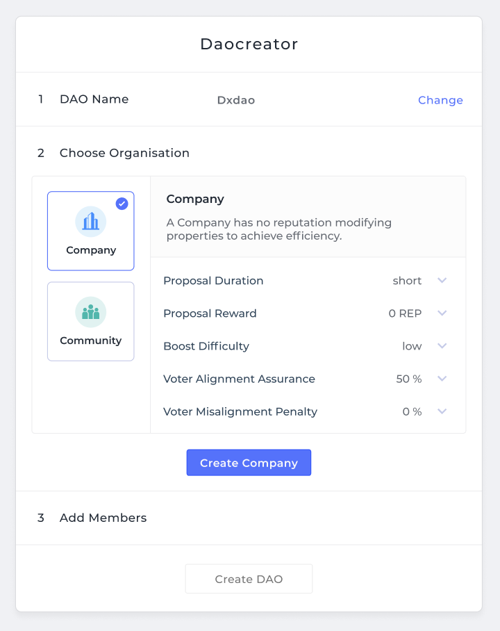

*An overview of dOrg's progress in the 2nd month (Nov 1 - 30) of our six month engagement with Genesis DAO.*

*For context, [see the recurring proposal here](Genesis_Recurring_Funding.md).*

# DAOcreator

- **Automated Alchemy Support** is here! Newly deployed DAOs will automatically show up in Alchemy if you visit their URL.

	- DAOtracker solution merged to [Arc](https://github.com/daostack/arc/pull/683) and [Subgraph](https://github.com/daostack/subgraph/pull/380)

- **Improvements & Bug Fixes** to the live DAOcreator app

	- [Various deployment improvements](https://github.com/dOrgTech/DAOcreator/pull/238)

		- Detect unsupported networks

		- Detect no web3 support
		
		- Add alert before window close during migration

		- Properly display errors in the migration log

	- [Remove whitespace from CSV import](https://github.com/dOrgTech/DAOcreator/pull/217)

	- [Ensure Rep and Token of founder not set to 0](https://github.com/dOrgTech/DAOcreator/pull/231)

	- [Fix leading 0 bug](https://github.com/dOrgTech/DAOcreator/pull/226)

	- [Fix time validation bug](https://github.com/dOrgTech/DAOcreator/pull/227)

	- Save DAO config in local storage & [preview config before resume](https://github.com/dOrgTech/DAOcreator/issues/232)

	- [Upgrade arcVersion dependency](https://github.com/dOrgTech/DAOcreator/pull/235)

- **DAOcreator Redesign** interactive wireframe & intensive user research

	- User research: focus group with DAOstack core, [DAOtalk forum post](https://daotalk.org/t/daocreator-redesign-feedback-round-1/993), [feedback form](https://dorgtech.typeform.com/to/RjMhEq), and [open call for one-on-ones](https://calendly.com/orishim/daocreator)

	- Play with [interactive wireframe here](https://www.figma.com/proto/t77rlBAupEeqIYHFBBpqrl/Playground?node-id=98%3A1072&viewport=213%2C267%2C0.1505504995584488&scaling=min-zoom)

	

### Next Steps

- Continue conducting user research to iterate on wireframe, develop into full mock-up, begin implementing front-end.

- Get newly deployed DAOs on Alchemy front-page. [Solution proposed here](https://github.com/daostack/alchemy/issues/1246).

# Use Cases & Integration

- **[Gasless Rep Redeem]([solution](https://github.com/dOrgTech/TxPayerService))**:

	- Dynamic handling of insufficient balance and gas limits

	- Migrated from Heroku to Netlify to run as serverless function

	- Testing and gathering feedback from DAOstack core (Jelle, Oren, Eylon)

- **[Auto-Generated Proposals from Alchemy URL](https://github.com/daostack/alchemy/pull/1226)**: Add the ability to open a proposal template for a user via embedding its pre-filled-out contents within the URL's parameters. Read more about the rationale [here](https://github.com/daostack/alchemy/issues/1181).

- **_prtcl Alchemy Integration**: Worked on [wiki componentent](https://github.com/dOrgTech/js-uprtcl/tree/wiki_component_creation)

- **Identity DAO: MVP Reached**: Soft-launched identity DAO with GoodDollar client

- **Nectar DAO Bootstrap U.I.: Launch-ready**: Rigorous testing, functionality and UX improvements in collaboration with DeversiFi and DAOstack core

### Next Steps

- Begin working on new tooling to enable dHack ETH Denver 

- Finish testing and ship Gasless Rep Redeem

- Continue to assist in the uprtcl integration

- Resume work on Bonding Curve Smart Contracts, Subgraph and Dapp for dxDAO

# Ecosystem

- Various contributions to core DAOstack repos

	- [Subgraph Rinkeby bug fix](https://github.com/daostack/subgraph/pull/392)

	- [Handle transaction timeout error](https://github.com/daostack/migration/issues/211)

	- Migration optimizations: [1](https://github.com/daostack/migration/issues/228), [2](https://github.com/daostack/migration/issues/229), [3](https://github.com/daostack/migration/issues/217)

	- Alchemy improvement issues opened: [GenericSchemeRegistry package](https://github.com/daostack/alchemy/issues/1244), [Detect DAO profile info](https://github.com/daostack/subgraph/issues/378), [Disqus integration bug](https://github.com/daostack/alchemy/issues/1206), [Tooltip persistence bug](https://github.com/daostack/alchemy/issues/1232)

	- Client improvement issues opened: [User-provided address sanitation](https://github.com/daostack/client/issues/338), [Transaction speed-ups](https://github.com/daostack/client/issues/318)

	- [Arc security vulnerability discovered and addressed](https://github.com/daostack/arc/issues/680)

- Continued to specify good first time and advanced issues for new OS contrubtors to DAOstack in a follow-up session with Kate, Shiv and others.

- Presented on DAOstack, dOrg and the DAOcreator tool at Jason's DAOfest event in Bangkok

### Next Steps

- Follow through on solutions for issues raised in DAOstack core repos

TODO

# DAO Admin

- Working with legal counsel to optimize agreement signing flows with paying DAO clients

- Spec-ing and discussing improvements to dOrg DAO's Rep, Token, and payment allocation flows

	- [Reputation-weighted Payment Splitter](https://github.com/dOrgTech/Ecosystem/issues/32)

	- [Proposal Scheduler](https://github.com/dOrgTech/Ecosystem/issues/28)

	- [Rep/Token Dynamics](https://github.com/dOrgTech/Ecosystem/issues/24)

- Released [dOrg Handbook](TODO) for our contributors

### Next Steps

TODO
