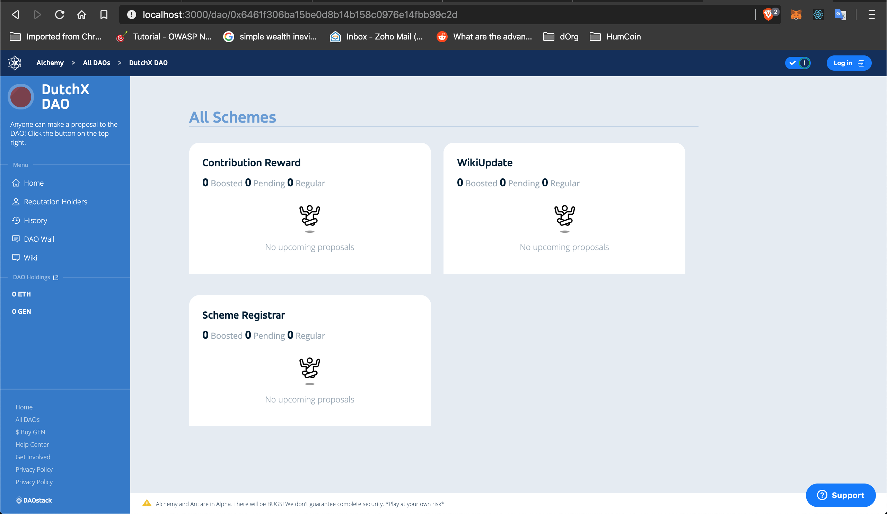

*An overview of dOrg's progress in the 3rd month (Dec 1 - 31) of our six month engagement with Genesis DAO.*

*For context, [see the recurring proposal here](Genesis_Recurring_Funding.md).*

# DAOcreator

- [Embed DAOcreator in Alchemy](https://github.com/daostack/alchemy/pull/1264) - awaiting approval from DAOstack core

- Developing the redesigned front-end

	- [x] Step 1 - [Set Naming of DAO](https://github.com/dOrgTech/DAOcreator/issues/260)
	- [x] Step 2 - Set DAO Configuration(Schemes) ([1](https://github.com/dOrgTech/DAOcreator/issues/261), [2](https://github.com/dOrgTech/DAOcreator/issues/269))
	- [x] Step 3 - [Set DAO Members](https://github.com/dOrgTech/DAOcreator/issues/262)

### Next Steps

- [Implement functional Step 4](https://github.com/dOrgTech/DAOcreator/issues/268)

- deploying a DAOForm Object.

- [Finish Styling/compliance of mocks](https://github.com/dOrgTech/DAOcreator/issues/274)

- [Advance Scheme Configuration Form](https://github.com/dOrgTech/DAOcreator/issues/275)
- [Accordion Component form all steps of Cotary Create form](https://github.com/dOrgTech/DAOcreator/issues/276)

# Use Cases & Integration

- **[Gasless Rep Redeem](https://github.com/dOrgTech/TxPayerService)) is live**

	- [One click button serverless deploy](https://github.com/dOrgTech/TxPayerService/pull/31)

	- [Send email when the service is low on funds](https://github.com/dOrgTech/TxPayerService/pull/40)

	- Other bug fixes & optimizations: [1](https://github.com/dOrgTech/TxPayerService/issues/38), [2](https://github.com/dOrgTech/TxPayerService/pull/35), [3](https://github.com/dOrgTech/TxPayerService/pull/37), [4](https://github.com/dOrgTech/TxPayerService/pull/34)

- **Auto-Generated Proposals from Alchemy URL**: Add the ability to open a proposal template for a user via embedding its pre-filled-out contents within the URL's parameters. 

	- Additional optimizations and testing (https://github.com/daostack/alchemy/pull/1226)

- **DAO's Mind**: 70% done (note this work is also partially funded by uprtcl)

	- [Wiki component added to Alchemy](https://github.com/dOrgTech/alchemy/commits/wiki_functionality_attachment)

	

		
	

	- Generic Scheme interface added 

	

		
	

	- [Additional development on wiki component](https://github.com/uprtcl/js-uprtcl/pull/21)

	- [Bundling into npm package](https://github.com/dOrgTech/daosMind)

- **BC-DAO** Applying to external grants to fund improvements and audit

- **GEN-locking-for-Rep U.I.** Restyling Nec-DAO for Genesis DAO token locking launch [1](https://github.com/dOrgTech/GEN-Locking/commit/459228d6fdbac2658574026893f6fcc813fcaba6)

### Next Steps

- DAO's Mind:
	- Allow the creation of proposals through the wiki's UI
	- Improve wiki component UI
	- Improve uprtcl smart contracts

- Gasless Rep Redeem: complete and test email notifications

# Ecosystem

- [Migration repo optimization](https://github.com/daostack/migration/pull/247): decrease size of ./contracts from 30mb to 7mb, with optional optimization to 1.7 mb.

- Added [mcDAI support to Alchemy](https://github.com/daostack/alchemy/pull/1269)

### Next Steps

...

# DAO Admin

- New release of [dOrg Handbook](https://dorg.gitbook.io/-/)

- [Migrate dOrg DAO]](https://github.com/dOrgTech/Ecosystem/issues/18) ?

- [New landing page] ? 

### Next Steps

...

