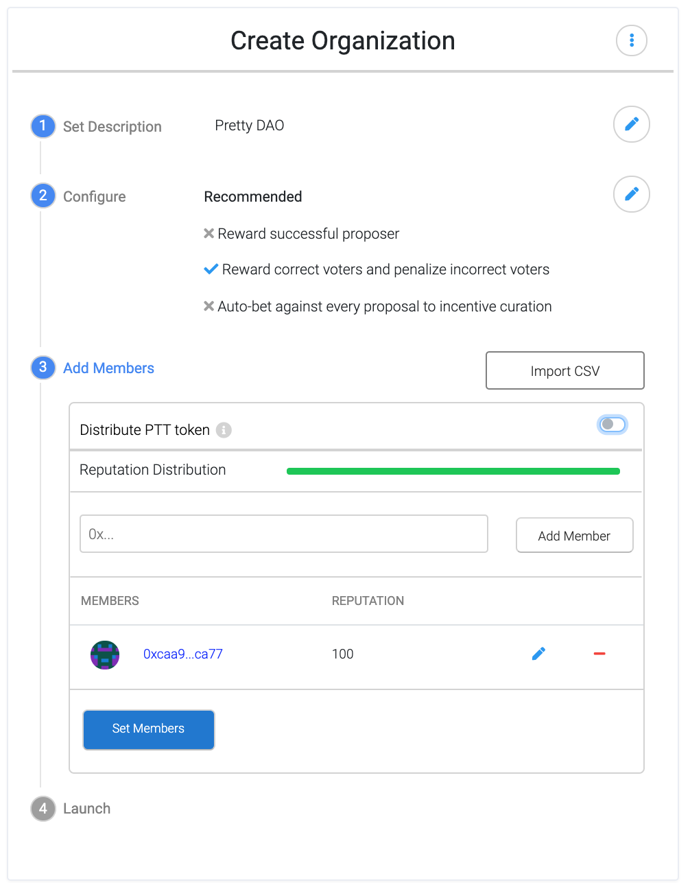

*An overview of dOrg's progress in the 4th month (Jan 1 - 31) of our six month engagement with Genesis DAO.*

*For context, [see the recurring proposal here](Genesis_Recurring_Funding.md).*

# DAOcreator

- **DAOcreator in Alchemy** is staged for deployment: finishing touches being worked on [here](https://github.com/daostack/alchemy/pull/1264)

- **DAOcreator V2 Pre-Alpha** is LIVE. Test it out [here](http://daocreator-v2.herokuapp.com/)

  - Tracking and resolving issues [here](https://github.com/dOrgTech/DAOcreator/issues)

  

  	
  

  
  - The key improvements of DAOcreaor V1 are related to *usability*
    
    - **Simple by Default**: Open the app and launch a DAO in under 1 minute
    
    - **Advanced Mode**: All  configuration options are still easily accessible for advanced users
    
    - **Educational On-boarding**:Learn how DAOstack works as you click through the tooltips
    
    - **1 Member DAOs**: User is included as the DAO's first member by default. No more opening metamask to copy & paste.

# Use Cases & Integration

- **DAO's Mind** is almost ready to deploy.
  - [PR](https://github.com/daostack/alchemy/pull/1314)

  

    
  

- **Gasless Rep Redeem** is tested & ready for ETH Denver.

  - Watch full demo video [here](https://www.youtube.com/watch?v=JaV7EdSGjE8)
  
- **Open Raise (formerly bc-dao)** is under active development again. We're focusing on functionalities relevant to the dxDAO use-case

  - Major functionality improvements
  
    - [Sell hooks](https://github.com/dOrgTech/OpenRaise/pull/82) - TODO
  
    - [Pre-mint & milestone caps](https://github.com/dOrgTech/OpenRaise/pull/90) - TODO
   
    - [Pre/post buy](https://github.com/dOrgTech/OpenRaise/pull/73) - TODO
  
    - [Rewards wallet](https://github.com/dOrgTech/OpenRaise/pull/84) - smart contract wallet responsible for distributing dividends
    
    - [ETH collateral](https://github.com/dOrgTech/OpenRaise/pull/63) - add ability to use ETH as collateral (rather than just erc20)
    
  - Front-end is coming along...
  
    - Trade history visualization - [1](https://github.com/levelkdev/BC-DAPP/pull/33), [2](https://github.com/levelkdev/BC-DAPP/pull/32)
   
    - [Buy](https://github.com/levelkdev/BC-DAPP/pull/28) flow
        

          
        
  
    
    - [Sell](https://github.com/levelkdev/BC-DAPP/pull/29) flow
        

          
        
  
     
  
  - Fresh [new docs](https://github.com/dOrgTech/OpenRaise/blob/master/docs/Basics.md) explaining the bonding curve and dividend claiming functionality

# Ecosystem

- Help spec out [custom token issue](https://github.com/daostack/alchemy/issues/1318)

- npm package sizing issues [1](https://github.com/daostack/migration/issues/265) & [2](https://github.com/daostack/migration/pull/264)

- Working with DAOstack core to prioritize dOrg's development tasks by use-case

# DAO Admin

- COALA workshop - helping lawyers to craft [DAO model law](https://medium.com/coala/the-dao-model-law-68e5360971ea) for unregistered DAOs to have international legal recognition. (First draft expected by end of June)

