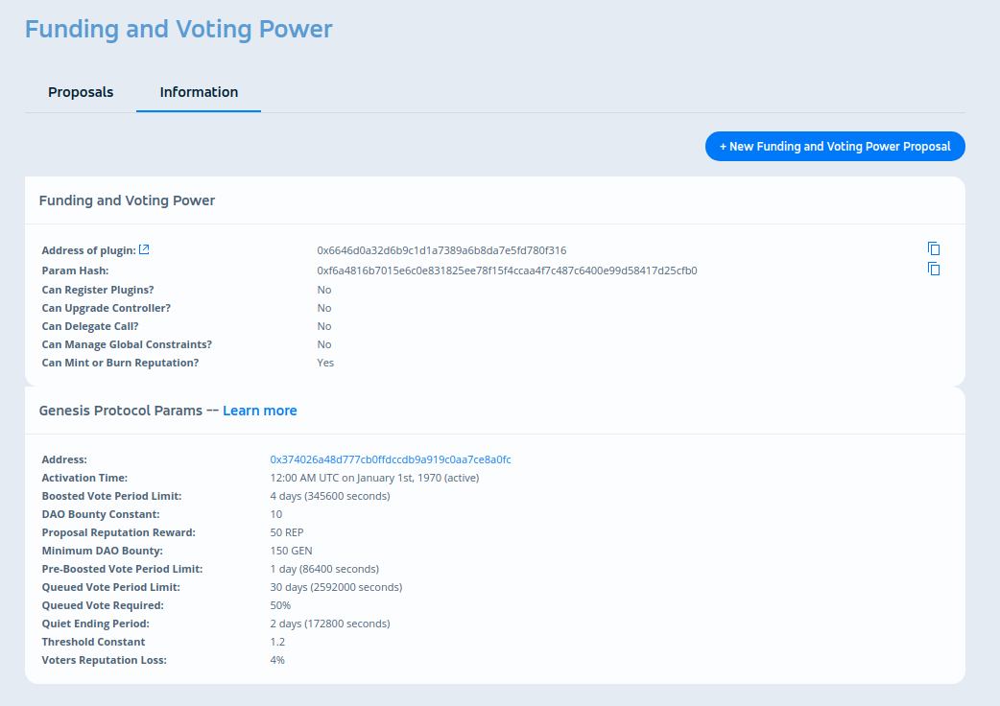

# RFC-02: Voting configuration editor

## User Story

### Current
Editing a DAO plugin's voting machine configuration is currently super complicated. Users do not have an easy to use interface within Alchemy for doing this. Currently, a user must:

- Find the address of the Genesis Protocol contract they want to use with their scheme.
- Add the voting parameters they want to use to the contract if they aren't already present. This can cause problems because the parameters need to be validated (sent in certain order, max-min values); and this will make the tx fail.
- Save the params hash for their parameters.

From here there are two possible paths, based on if the scheme is universal or non-universal. For universal schemes the user would need to:
- Call [setParameters](https://github.com/daostack/arc/blob/master/contracts/universalSchemes/ContributionReward.sol#L99) on the universal scheme with the voting machine address and their voting params hash.
- Save the scheme's params hash.
- Create a scheme registrar proposal to "edit" the existing scheme, and insert the scheme's params hash that was save previously.

For non-universal schemes the user would need to:
- Instantiate a new instance of the scheme that they want to modify.
- Call `initialize(...)` on this new instance with the voting machine's address and params hash.
- Add the non-universal scheme to the subgraph.
- Create 2 scheme registrar proposals, one to remove the old scheme, and one to add the new scheme.

NOTE: The "non-universal" workflow will be improved with Arc Hives in the "new" version of alchemy. For the sake of this proposal, we'll focus on the universal workflow. 80% of the code for editing params of non-universal schemes can be reused in the "new" alchemy. The only thing that will change will be how the new params are applied to the scheme.

### New
As a non technical user of the DAO I want to manage and set up my organization in a particular way. If the DAO wants to change the configuration as it grows and evolves, we will be able to do it through the UI, making it easier to add a new voting configuration for the desired scheme.

All I would have to do is go to the "information" tab of a scheme, click "edit" on the voting machine configuration, make my changes and click "apply". This will trigger a proposal in the DAO to apply these changes.

## Impact on Adoption
Users will start to appreciate how versatile the Genesis Protocol is in allowing their fund to curate quality proposals and scale effectively over time.

Additionally, this will remedy issues that a lot of DAO founders had initially with DAOstack where they were unable to change their DAO's configuration post launch.

## Roadmap

| Time | Workload | Description | 
|-|-|-|
| 2 weeks | 1.0 FT | Client Updates: Voting Machine Form (`@dorgtech/daocreator-lib` has this already), Set Voting machine Params, Get Voting Params Hash |
| 2 weeks | 1.0 FT | Alchemy Updates: Edit Voting Params Button + Form Fields, Save Voting Params Button, Post Scheme Registrar Proposal |

## Detailed Design

We want to modify the existing "plugin information" view to allow for users to make edits to the genesis protocol form, and "save" those changes to their DAO. This will prompt the users with 3 transactions:

- Add the parameters to the voting machine (Genesis protocol contract instance).
- Add the parameters to the universal scheme.
- Create a proposal on Plugin Manager to edit the plugin being modified.

We need to do this with every scheme, one by one, we are going to start with the universal ones (Funding and Voting Power & Plugin Manager).

## Open Questions

None
