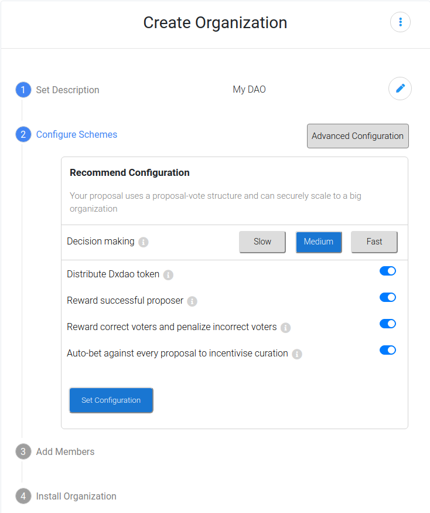

*An overview of dOrg's progress in the 3rd month (Dec 1 - 31) of our six month engagement with Genesis DAO.*

*For context, [see the recurring proposal here](00-Recurring-Funding.md).*

# DAOcreator

- **DAOcreator in Alchemy**: We've embedded the first version of the UI in Alchemy. The [PR](https://github.com/daostack/alchemy/pull/1264) is currently awaiting approval from DAOstack core.

  

    
  

- **DAOcreator Redesign**: Development is underway, and a usable beta is coming soon. You can test an early WIP version [here](https://daocreator-v2.herokuapp.com/). Please send any and all feedback to *contact@dorg.tech*.
  - Progress can be tracked [here](https://github.com/orgs/dOrgTech/projects/10).

  

    
    
  

- **DAOcreator Packages Published**: Packages for both the core logic and V1 UI have been published to NPM. This will allow any developer to either embed the UI within their applications, or easily build their own UI and have 80% of the work done for them by the core library.
  - [DAOcreator Core Library](https://www.npmjs.com/package/@dorgtech/daocreator-lib)
  - [DAOcreator V1 UI](https://www.npmjs.com/package/@dorgtech/daocreator-ui-v1)

### Next Steps 

- Finish V2 UI, progress can be tracked [here](https://github.com/orgs/dOrgTech/projects/10).

- Get newly deployed DAOs on Alchemy front-page. [Solution proposed here](https://github.com/daostack/alchemy/issues/1246).

# Use Cases & Integration

- **[Gasless Rep Redeem](https://github.com/dOrgTech/TxPayerService):** A service for paying transaction fees
  - Deploy with [one button click](https://github.com/dOrgTech/TxPayerService/pull/31) as a serverless function
  - [Notification emails](https://github.com/dOrgTech/TxPayerService/pull/40) when the service is low on funds
  - Other bug fixes & optimizations: [1](https://github.com/dOrgTech/TxPayerService/issues/38), [2](https://github.com/dOrgTech/TxPayerService/pull/35), [3](https://github.com/dOrgTech/TxPayerService/pull/37), [4](https://github.com/dOrgTech/TxPayerService/pull/34)

- **[Alchemy Proposal Template URLs](https://github.com/daostack/alchemy/pull/1226):** Add the ability to open a proposal template for a user via embedding its pre-filled-out contents within the URL's parameters.
  - Added additional optimizations and tests

- **DAO's Mind:** 70% done (note this work is also partially funded by uprtcl)
  - [Wiki component added to Alchemy](https://github.com/dOrgTech/alchemy/commits/wiki_functionality_attachment)

  

    
  

  - Generic Scheme interface added 

  

    
  

  - [Additional development on wiki component](https://github.com/uprtcl/js-uprtcl/pull/21)

  - [Bundling into npm package](https://github.com/dOrgTech/daosMind)

- **Open Raise (Previously BC-DAO):** Applying to external grants to fund improvements and audit
  - [**GitCoin Grant**](https://gitcoin.co/grants/255/open-raise-3)
  

    
  

- **Alchemy GEN-Locking-For-REP UI:** We started working on the GEN locking UI for Alchemy by restyling the UI we created for NecDAO.
  * Code available [here](https://github.com/dOrgTech/GEN-Locking)
  

    
  

### Next Steps

- DAO's Mind:
  - Allow the creation of proposals through the wiki's UI
  - Improve wiki component UI
  - Improve uprtcl smart contracts

- Gasless Rep Redeem:
  - Complete and test email notifications

# Ecosystem

- [Migration ABI Optimizations](https://github.com/daostack/migration/pull/247)
  - Decreases size of ./contracts from 30mb to 7mb.
  - With an optional optimization that strips bytecode, the size goes to 1.7 mb.

- Added [mcDAI support to Alchemy](https://github.com/daostack/alchemy/pull/1269)

# DAO Admin

- New release of [dOrg Handbook](https://dorg.gitbook.io/-/)
  

    
  

- New landing page that better publicizes all of the projects we've been working on is almost complete
  

    
  

- New experimental internal budgeting system rolled out

### Next Steps
- Release new landing page
- Automate budgeting system, and release publicly
- Migrate dOrg DAO to fresh instance [to resolve current issues](https://github.com/dOrgTech/Ecosystem/issues/18)
