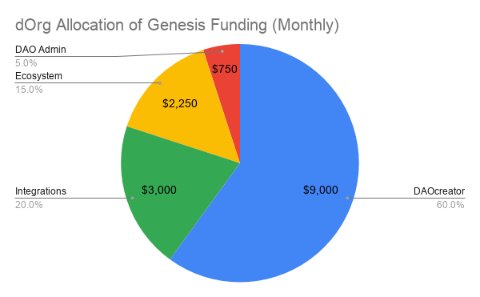

# Genesis Recurring Funding Proposal

> $15k per month x 6 months (Q4 2019 & Q1 2020)

# Summary

dOrg is the first team to emerge from the Genesis community and begin decentralizing the development of the DAO Stack. After a successful period of incubation, it was [recently announced](https://daotalk.org/t/on-the-importance-of-community-oversight-shifting-dorg-s-funding-to-genesis/896) that DAOstack will cease funding dOrg and direct this extra monthly funding to Genesis. We have been discussing this transition for a long time, and are excited to finally take the plunge!

With this proposal, we are officially asking Genesis to fund our ongoing software development and open-source advocacy efforts in the DAOstack ecosystem / GEN economy. This proposal will:

1. Signal Genesis DAO's intent to fund dOrg for the attached deliverables at a rate of $15k/month for 6 months (Q4 2019 & Q1 2020)
2. Send dOrg payment for the first period (Oct 1 - Oct 31). [See progress report here](Genesis_Milestone_01.md).

# Past Work

We have published all of dOrg's milestone reports from our incubation period with DAOstack [[1](DAOstack_Milestone_01.md)][[2](DAOstack_Milestone_02.md)][[3](DAOstack_Milestone_03.md)]. Here are some highlights:

- Constructed a [DAO creator](https://dorg.tech/#/dao-creator) application for the simple deployment of DAOstack native DAOs.
- Developed a [fundraising module]((https://github.com/dOrgTech/BC-DAO/blob/master/README.md)) that allow DAOs to [automatically distribute dividends to its token purchasers](https://www.notion.so/dorg/BC-DAPP-Proposal-9c4dec4870ed48a19b39f5be6ccbf373#93f5e757c3b74a5bbe5748702594de62).
- Pioneered a DAO [legal solution](https://coindesk.com/dorg-founders-have-created-the-first-limited-liability-dao) and migrated all company funds and decision-making authority to our DAO.
- Developed an [easy to use React Component Library](https://github.com/dOrgTech/DAOcomponents) to support DAOstack DAO app integration.
- Partnered with GoodDollar to build a DAOstack-based [identity solution](https://github.com/dOrgTech/id-dao).
- Made numerous open-source contributions to core DAOstack repositories.
- Helped developers and other external teams get started building on DAOstack.

# Deliverables

### Timeline

- 6 months
- Oct 1, 2019 – March 31, 2020

### Accountability

For each initiative, we are dividing up the deliverables across the two halves of the six month period: Q4 2019 and Q1 2020. We will also link each monthly payment proposal to a new progress report in [this directory](https://github.com/dOrgTech/Ecosystem/tree/master/DAOstack). This reporting structure will keep dOrg accountable to Genesis while avoiding unnecessary bureaucratic overhead.

## DAOcreator | 60%

*Refine design, add features and squash bugs from user feedback*

**Q4 2019**: *Complete a total redesign of the DAOcreator App*

- Simple by default (templates)
- All modifications available to advanced users
- Easy deploy and automatic Alchemy support
- Educational on-ramping informed by user research
- Auto-save progress

**Q1 2020**: *Integrate additional functionality for "bottom-up DAOs"*

- Existing reputation bootstrapping schemes (token snapshot, token locking, token auctions)
- New funding schemes (bonding curve + dividend tokens, subscription fees)
- Multiple Generic Action schemes
- Custom schemes

## Use Cases & Integrations | 20%

*Identify and aggressively target high-impact DAOstack use cases and integrations.*

- Collaborate with external product/protocol teams ([GoodDollar](https://github.com/dOrgTech/ID-DAO), [Gnosis](https://github.com/dOrgTech/BC-DAO), [DeversiFi](https://github.com/dOrgTech/NectarDAO-Bootstrapper), [_prtcl](https://twitter.com/uprtcl/status/1169929023977402370), [Veriledger](https://veriledger.io))
- Unblock high-impact use cases and help wherever we can
- Work closely with DAOstack's business development personnel (Eric, Nathalia, Kate, Matan, Eylon, Felipe, Pat, Nave)

**Q4 2019**: *Improve functionality of existing stack*

- [Gasless Rep Redeem](https://github.com/dOrgTech/Ecosystem/issues/17)
- [Stake in any token](https://github.com/dOrgTech/Ecosystem/issues/15)
- [_prtcl Alchemy Integration (DAO's Mind)](https://alchemy.daostack.io/dao/0x294f999356ed03347c7a23bcbcf8d33fa41dc830/proposal/0xcbdc3612e6d73cb47cdb4c44e1db18213eb0cf8c17f4870b8beca33cffbd7d3f)
- Continue to execute on externally funded DAO projects...
  - [Bonding Curves For DAOs](https://github.com/dorgtech/bc-dao) -> Gnosis & DxDAO
  - [Identity DAO](https://github.com/dorgtech/id-dao) -> GoodDollar
  - [Nectar DAO](https://github.com/dOrgTech/NectarDAO-Bootstrapper) -> DeversiFi

**Q1 2020:** *Enable new functionality through external interactions*

- Generic Actions (e.g. rDAI, Uniswap and [more ideas here](https://daotalk.org/t/dapp-integrations-in-daostack/578))
- Signalling Scheme (e.g. [Github Actions](https://github.com/dOrgTech/Ecosystem/issues/16))

## Ecosystem Development | 15%

*Catalyze other builders in the DAOstack ecosystem.*

- On-board & support new teams (e.g. [Ape Unit](https://apeunit.com/), [AliceDapp](https://www.alicedapp.com/), [Odyssy](https://odyssy.io/), [Level K](https://www.levelk.io/)) and individual developers
- Add to existing documentation and create new materials as needed (e.g. [DAOstack ecosystem](https://github.com/daostack/ecosystem), [DAOtalk resource list](https://daotalk.org/t/resource-list-dao-r-d/572))
- Contribute to open-source DAOstack repositories as we find issues and potential improvements
- Work closely with DAOstack's open source personnel (Shiv, Adam, Oren, Alex, Pat, Kate)

**Q4 2019**:

- Kickstart the DAOstack/Ecosystem and help populate initial set of technical bounties for Genesis
- Help 2-3 new technical teams with their first Genesis proposal
- Onboard and launch 3-5 small to mid-sized DAOs

**Q1 2020**:

- Help 2-3 new technical teams with their first Genesis proposal
- Onboard and launch 5-7 small to mid-sized DAOs
- Onboard and launch 1-2 large DAOs

## DAO Admin | 5%

*Miscellaneous operating costs of running dOrg as a DAOstack DAO.*

- Technical maintenance, such as properly [upgrading and migrating the dOrg DAO](https://github.com/dOrgTech/Ecosystem/issues/18)
- Research and Develop ways to streamline [legal](https://github.com/dOrgTech/LL-DAO/tree/master/templates) (contracting, company formation, annual reports), [accounting](https://medium.com/veriledger/dao-accounting-dc496e6fb57f) (bookkeeping, financial statements, tax reporting) and other administrative functions for compliant DAOs
- Work closely with DAOstack's operational personnel (Eyal, Yehonatan) and key third-party experts (Veriledger, Gravel & Shea)

# About dOrg

dOrg is a coalition of web3 freelancers focused on DAOs, DeFi and web3 tooling. We are structured as a DAOstack DAO and registered in Vermont, USA as a Blockchain-Based LLC.

### **Active Rep Holders**

Here is a survey of our current active members. Because dOrg is designed to support a flexible contributor base, this list is subject to change.

| Name | Specialization | Worked on |
|-|-|-|
| Christian | Programming | ID-DAO, BC-DAO |
| Hector | Programming | DAOcreator, TxPayer |
| Thomas | Programming | BC-DAO, Nec-DAO |
| John | Programming | BC-DAO, Nec-DAO |
| Ori | Operations | ID-DAO, BC-DAO, DAOcreator, TxPayer, Nec-DAO |
| Bogdan | Programming | BC-DAO |
| Zak | Design | ID-DAO |
| Jordan | Programming | DAOcreator, DAOcomponents, ID-DAO, BC-DAO, Nec-DAO |
| Cesar | Programming | DAOcreator, TxPayer |
| Corkus | Design | BC-DAO, Nec-DAO, DAOcreator |

### Links

- [DAO](https://alchemy.daostack.io/dao/0xbe1a98d3452f6da6e0984589e545d4fc25af7526)
- [Website](https://dorg.tech/#/)
- [Discord](https://discordapp.com/invite/Z5R4CcS)
- Articles: [Gnosis Community Spotlight](https://blog.gnosis.pm/geco-community-spotlight-fd7ee4b8c8a4), [Coindesk](https://www.coindesk.com/dorg-founders-have-created-the-first-limited-liability-dao), [Cointelegraph](https://cointelegraph.com/news/dorg-llc-purports-to-be-first-legally-valid-dao-under-us-law)
