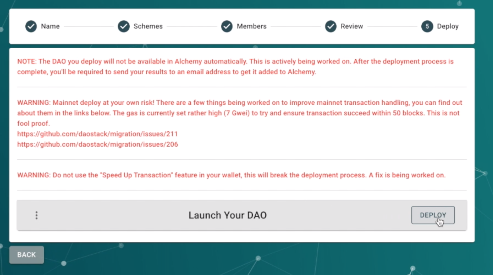
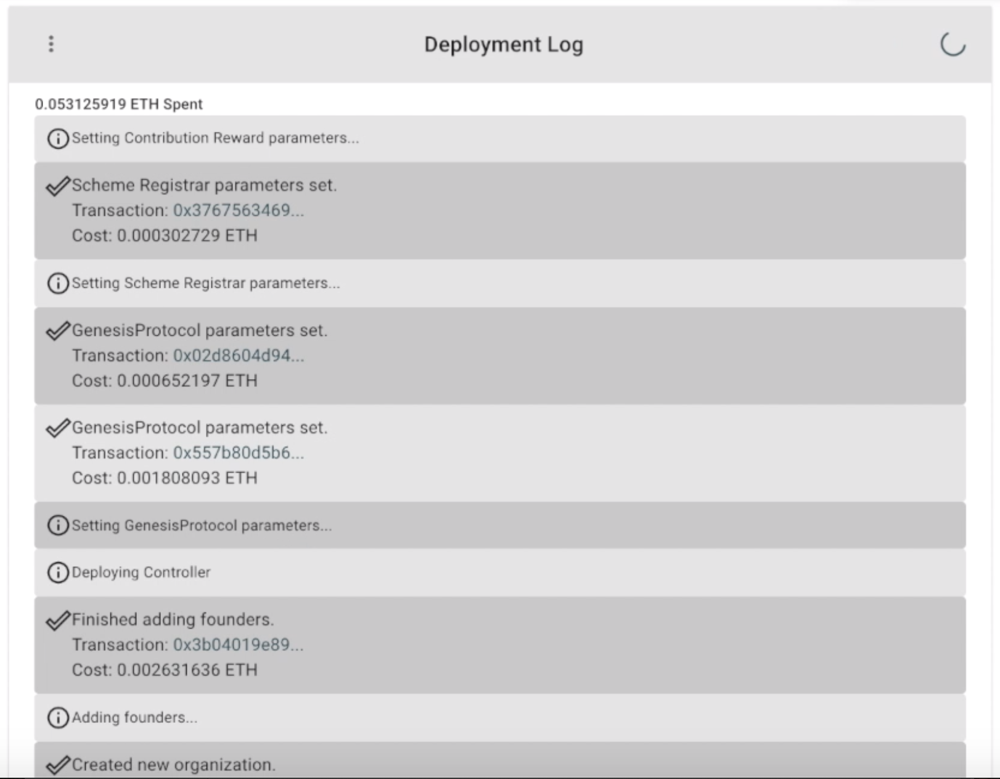
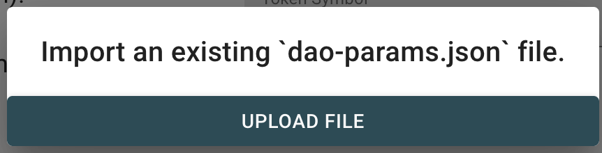
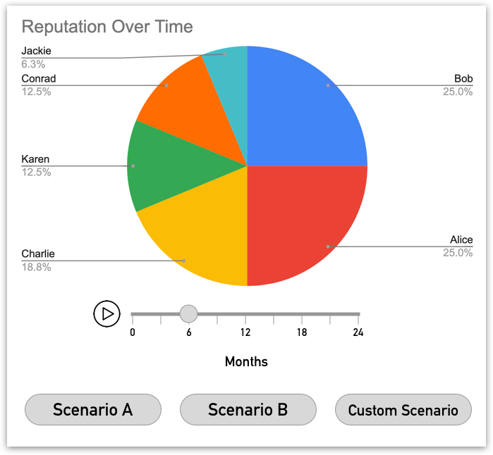

*An overview of dOrg's progress in the 1st month (Oct 1 - 31) of our six month engagement with Genesis DAO.*

*For context, [see the recurring proposal here](Genesis_Recurring_Funding.md).*

# DAOcreator

*In addition to several UX and functionality improvements, we got mainnet deployments working and finished specifying DAOcreator beta.*

- **Mainnet deployments** now supported inside the app!
    - Detailed warnings and instructions

    

    - Full, exportable deployment log

    

- **Import DAO** now supported

    

- Improved [import members from CSV sanitation](https://github.com/dOrgTech/DAOcreator/issues/215)
- [Subgraph PR](https://github.com/daostack/subgraph/pull/215) and [DAOtracker PR](https://github.com/daostack/arc/pull/640) fixed and merged - this lays the groundwork for automated Alchemy support!
- Beta release redesign specified and timelined

### Future

- Automated Alchemy support (Integrate DAOtracker to the migration scripts and subgraph)
- Design and iterate on new design mock-ups with community research
- Begin implementing functional version of DAOcreator beta from wireframes

# Use Cases & Integration

- **Gasless Rep Redeem**: Allows ReputationFromToken to be redeemed without needing any gas in order to support seemless onboarding for future dHacks and DAOfests. [[problem](https://github.com/dOrgTech/Ecosystem/issues/17)] [[solution](https://github.com/dOrgTech/TxPayerService)]
- Began specifying [Reputation simulation app](https://github.com/dOrgTech/Ecosystem/issues/19) for DAOs to visualize and model changes in Rep over time.

    

- **_prtcl Alchemy Integration**: We've kicked off this project, and development should start around November 11th. Genesis proposal viewable [here](https://alchemy.daostack.io/dao/0x294f999356ed03347c7a23bcbcf8d33fa41dc830/proposal/0xcbdc3612e6d73cb47cdb4c44e1db18213eb0cf8c17f4870b8beca33cffbd7d3f).

### Future

- Finish testing and ship Gasless Rep Redeem
- Finish specifying and start implementing Rep simulation
- Continue to assist in the _prtcl integration

# Ecosystem

- Started [DAOstack-collab](https://github.com/dOrgTech/daostack-collab/) repo on github to support joint roadmaps across technical teams in the ecosystem  → forked into [DAOstack's Ecosystem repo](https://github.com/daostack/Ecosystem)
- Helped to begin specifying good "first time issues" for new open-source contributors (several of which have been more fully elaborated on [here](https://github.com/daostack/Ecosystem/issues))
- Launched the [DAOfest DAO](https://alchemy.daostack.io/dao/0x8990e11b69403Ea53Ef2B32434bBD7dBf84B5234) with Felipe
- Presented to the Bucharest Blockchain Group on how DAOstack can be used to manage a legal entity and responsibly fundraise [[event](https://www.eventbrite.com/e/blockchain-based-llc-and-funding-tools-for-daos-tickets-74091444505)] [[presentation](https://docs.google.com/presentation/d/1fs3cufwBT4dBWqi0VB0UaVCarkauFORdBwpSXGZTSkI/edit?usp=sharing)]
- Pro Bono DAO advising one legal-tech consulting agency and one mobile design agency in launching their own (dOrg style) small DAOs. We believe a proliferation of small DAOs on the platform is equally important as having several large DAOs.

### Future

- Help bountify additional tasks for open-source
- Help anyone else in the community launch a DAO

# DAO Admin

*This past period we focused heavily on bookkeeping and tax prep.*

- 90% through reconciling all of dOrg's transactions with Veriledger. These will allow us to create the first official 'DAO Financial Statements'
- Submitted dOrg tax election to IRS
- Reseraching tax-exempt benefits for Rep holders– such as reimbursements for Healthcare, Coworking and Data expenses.

### Future

- Create tax guidelines for the dOrg DAO contractors
- Define reimbursement protocol for dOrg DAO contractors
