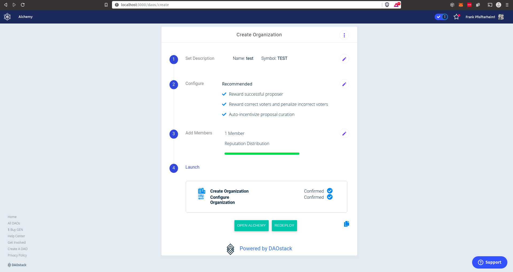
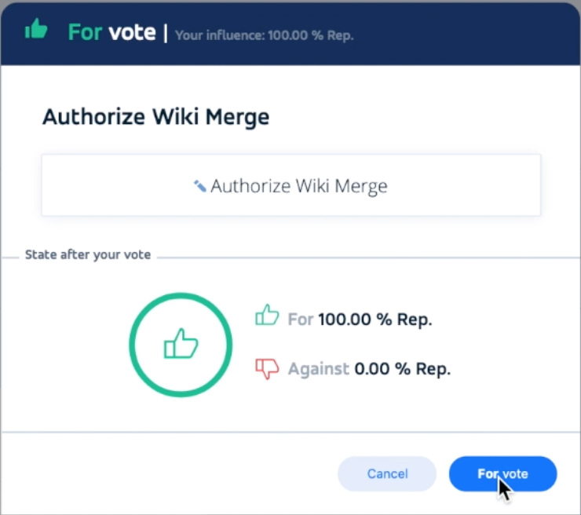
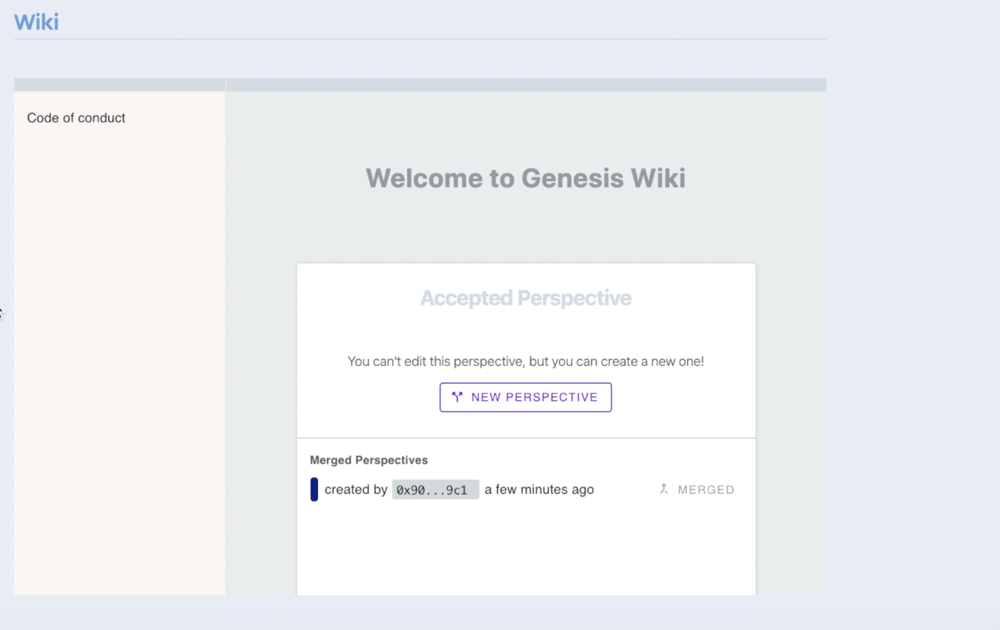

*An overview of dOrg's progress in the 6th month (Mar 1 - 31) of our six month engagement with Genesis DAO.*

*For context, [see the recurring proposal here](Genesis_Recurring_Funding.md).*

# DAOcreator

- [Embeded new DAOcreator into Alchemy](https://github.com/dOrgTech/alchemy/commits/daocreator-v2-embed)

  

  	
  

- Resolve [various minor issues](https://github.com/dOrgTech/DAOcreator/pulls?q=is%3Apr+is%3Aclosed)

- Promotional [tweet with demo video](https://twitter.com/dOrg_tech/status/1237769212099264518?s=20) + [medium article explainer](https://twitter.com/Ingalandia/status/1237525857981218816)

# DAO's Mind

  - [Wrap up usable PoC](https://github.com/daostack/alchemy/pull/1314)

  	- [DEMO VIDEO](https://youtu.be/nSuwobJI3-4)

  

  	
  	
  

# Alchemy

- Specify the following alchemy improvement proposals [here](../Alchemy)

| Proposal | Description |
|-|-|
| [Generic Action UI](../Alchemy/01-generic-action-tooling.md) | Easily add/remove Generic Actions through the UI |
| [Voting Config Editor](../Alchemy/02-voting-configuration-editor.md) | Improve UI for editing a plugin's voting machine configuration |
| Generic Generic Action | Scheme that allows DAO to execute any action on any contract |
| NFT Issuance | Allow DAO to issue different NFTs |
| ENS Manager | Dedicated view for managing ENS sites |
| Registry Manager | Dedicated view for DAOs to view and edit registries |
| DAOcomponents (Embeddable Alchemy) | Embed simplified DAOstack UI components into external websites |
| DAO Wiki (Next Steps) | Ship & improve DAO-controlled Wiki |
| Abridged Integration | |
| 3box Comments | |
| Documentation Overhaul | Developer docs for Alchemy development |
| DevOps Overhaul | |
| Design Overhaul | Redesign core elements of the UI (proposal feed, schemes, redemption,..) |
| Bug Squashing / Maintenance | Continue to identify, triage and squash bugs |

# Biz Dev

- Simplify & standardize dOrg's DAOstack service offering
	- Set pricing for Essentials + Add-ons:
		- *Essentials* = Configure the necessary Generic Actions & deploy with Rep whitelist
		- *Bootstrap Solution* = Rep bootstrap app custom styling & parameterization for token lock, bid and snapshot
		- *On-boarding & Engagement* = Stakeholder on-boarding, proposal priming, user feedback, social media campaign, content creation
		- *Custom Governance UI* = Customized governance app that can be embedded in the client's own site
	- This can serve as our plan of attack for attracting DeFi projects to DAOstack
	- Currently testing this out with a few potential clients ([NecDAO](../NecDAO/DAOify_NecDAO.pdf), Bancor, Totle, Orchid)

- Develop tailored offering for large institutions (non-profits, NGOs, corporates) to run DAOstack pilots
	- Slush fund for their employees
	- Standard pricing for set-up
	- Seed everyone with ETH & GEN for participation
	- Set up (monthly) contribution drip contract for the institution

- Develop plan of attack for DAOstack adoption among SMEs (agencies, consulting shops, worker co-op)
	- We already have real interest from several companies on this front
	- Make it way easier for them to try out DAOstack through
		- On-boarding workshops & facilitated weekly calls
		- 1-page guide on practical operational questions (budgeting, legal, bookkeeping) 

